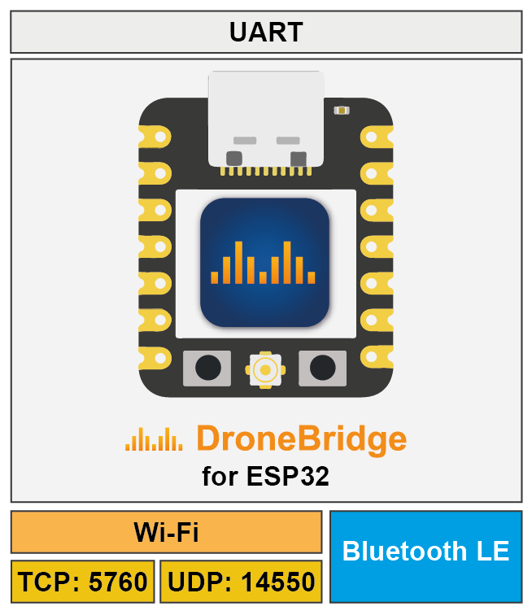
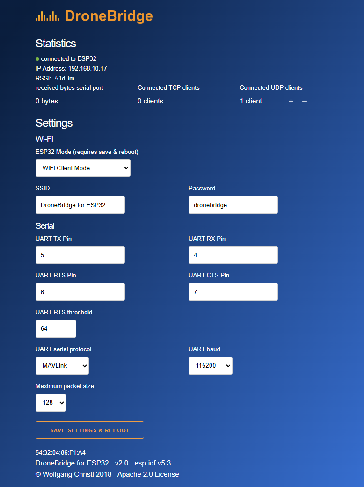

# DroneBridge for ESP32
A DroneBridge enabled firmware for the popular ESP32 modules from Espressif Systems. Probably the cheapest way to
communicate with your drone, UAV, UAS, ground based vehicle or whatever you may call them.

It also allows for a fully transparent serial to WiFi pass through link with variable packet size
(Continuous stream of data required).

DroneBridge for ESP32 is a telemetry/low data rate only solution. There is no support for cameras connected to the ESP32 since it does not support video encoding.


## Features
-   Bi-directional transparent serial to WiFi & ESP-NOW link
-   Support for MAVLink, MSP, LTM or any other payload
-   Affordable: ~7€
-   Up to 150m range using WiFi
-   Up to 1km of range using ESP-NOW or Wi-Fi LR Mode (sender & receiver must be ESP32 with LR-Mode enabled [(ESP32 C2 is not supported)](https://docs.espressif.com/projects/esp-idf/en/latest/esp32/api-guides/wifi.html#lr-compatibility))
-   Weight: <10 g
-   Supported by: QGroundControl, DroneBridge for Android (app), mwptools, impload etc.
-   Easy to set up: Power connection + UART connection to flight controller
-   Fully configurable through easy to use web interface
-   Parsing of LTM & MSPv2 for more reliable connection and less packet loss
-   Fully transparent telemetry downlink option for continuous streams like MAVLink or any other protocol
-   Reliable, low latency, light weight
-   Upload mission etc.




Blackbox concept. UDP & TCP connections possible. Automatic UDP uni-cast of messages to port 14550 to all 
connected devices/stations. Allows additional clients to register for UDP. Client must send a packet with length > 0 to UDP port of ESP32.

## Download or Compile

Ready to use binaries for ESP32 via [GitHub releases](https://github.com/DroneBridge/ESP32/releases).  
Or compile using esp-idf v5.1:
-   ESP32   `idf.py set-target esp32 build`
-   ESP32S2 `idf.py set-target esp32s2 build`
-   ESP32S3 `idf.py set-target esp32s3 build`
-   ESP32C3 `idf.py set-target esp32c3 build`

## Hardware

**Officially supported and tested boards:**  
Do the project and yourself a favour and use one of the officially supported and tested boards below.   
These boards are very low in price, have everything you need and are also very small. Perfect for use on any drone.   

* [Official board for DroneBridge for ESP32](https://www.ebay.de/itm/116111278197) - spares from first batch, pre-installed and ready for use  
currently shipping to EU only - contact seller for non-EU shipping options

Other official options
* [Seeed Studio XIAO ESP32C3](https://www.seeedstudio.com/Seeed-XIAO-ESP32C3-p-5431.html) + [External antenna](https://www.seeedstudio.com/2-4GHz-2-81dBi-Antenna-for-XIAO-ESP32C3-p-5475.html) for more range.

[For further info please check the wiki!](https://github.com/DroneBridge/ESP32/wiki/Supported-Hardware)

## Installation/Flashing using precompiled binaries

First download the latest release from this repository.
[You can find them here](https://github.com/DroneBridge/ESP32/releases).

There are many multiple ways on how to flash the firmware.  
**[For further info please check the wiki!](https://github.com/DroneBridge/ESP32/wiki/Flashing-DroneBridge-for-ESP32)**

## Wiring

1.  Connect the UART of the ESP32 to a 3.3V UART of your flight controller. It is not recommended to use the ESP32s pins that are marked with TX & RX since they often are connected to the internal serial ouput. Go for any other pin instead!
2.  Set the flight controller port to the desired protocol.

**Check out manufacturer datasheet! Only some modules can take more than 3.3V. Follow the recommendations by the ESP32 boards manufacturer for powering the device**  
**[For further info please check the wiki!](https://github.com/DroneBridge/ESP32/wiki/Wiring-Instructions)**

## Configuration
1.  Connect to the wifi `DroneBridge ESP32` with password `dronebridge`
2.  In your browser type: `dronebridge.local` (Chrome: `http://dronebridge.local`) or `192.168.2.1` into the address bar.
 **You might need to disable the cellular connection to force the browser to use the WiFi connection**
3.  Configure as you please and hit `save`



**[For further info please check the wiki!](https://github.com/DroneBridge/ESP32/wiki/Configuration)**

## Use with DroneBridge for Android or QGroundControl


-   Use the Android app to display live telemetry data. Mission planning capabilities for MAVLink will follow.
-   The ESP will auto broadcast messages to all connected devices via UDP to port 14550. QGroundControl should auto connect
-   Connect via **TCP on port 5760** or **UDP on port 14550** to the ESP32 to send & receive data with a GCS of your choice. **In case of a UDP connection the GCS must send at least one packet (e.g. MAVLink heart beat etc.) to the UDP port of the ESP32 to register as an end point.**

## Developers

### Compile
 You will need the Espressif SDK: esp-idf + toolchain. Check out their website for more info and on how to set it up.
 The code is written in pure C using the esp-idf (no arduino libs).

 **This project supports the v5.1.2 of ESP-IDF**  
 Compile and flash by running: `idf.py build`, `idf.py flash`

 ### API
The webinterface communicates with a REST:API on the ESP32. You can use that API to set configurations not selectable 
via the web-interface (e.g. baud rate). It also allows you to easily integrate DroneBridge for ESP32.


#### Request settings
```http request
http://dronebridge.local/api/settings/request
```

#### Request stats
```http request
http://dronebridge.local/api/system/stats
```

#### Request IP and port of active UDP connections**
```http request
http://dronebridge.local/api/system/conns
```

#### Trigger a reboot
```http request
http://dronebridge.local/api/system/reboot
```

#### Trigger a general settings change:
Send a valid JSON
```json
{
  "esp32_mode": 1,
  "wifi_ssid": "DroneBridge ESP32",
  "wifi_pass": "dronebridge",
  "ap_channel": 6,
  "tx_pin": 17,
  "rx_pin": 16,
  "telem_proto": 4,
  "baud": 115200,
  "msp_ltm_port": 0,
  "ltm_pp": 2,
  "trans_pack_size": 64,
  "ap_ip": "192.168.2.1"
}
```
to
```http request
http://dronebridge.local/api/settings/change
```

#### Manually add a UDP connection target:
Send a valid JSON
```json
{
  "ip": "XXX.XXX.XXX.XXX",
  "port": 452
}
```
to
```http request
http://dronebridge.local/api/settings/addudp
```

#### Assign a static IP to the ESP32 when in WiFi client mode:
Send a valid JSON to set static IP, send the same JSON but with empty strings (``"client_ip": ""``) to remove static IP setting
```json
 {
  "client_ip": "XXX.XXX.XXX.XXX",
  "netmask": "XXX.XXX.XXX.XXX",
  "gw_ip": "XXX.XXX.XXX.XXX"
 }
```
to
```http request
http://dronebridge.local/api/settings/setstaticip
```

 ### Testing
 To test the frontend without the ESP32 run 

 ```sh
 npm install -g json-server
 json-server db.json --routes routes.json
 ```
Set `const ROOT_URL = "http://localhost:3000/"` inside `index.html` and the `<script>` block
